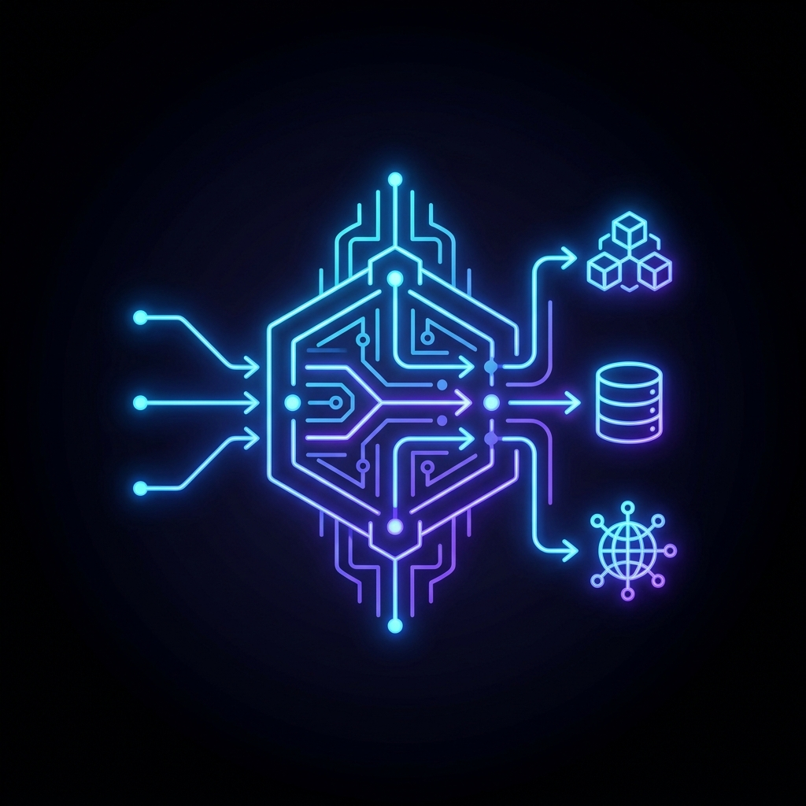
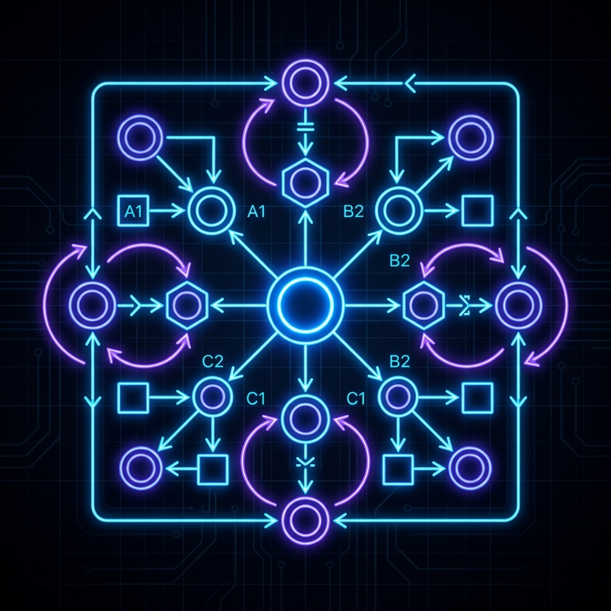
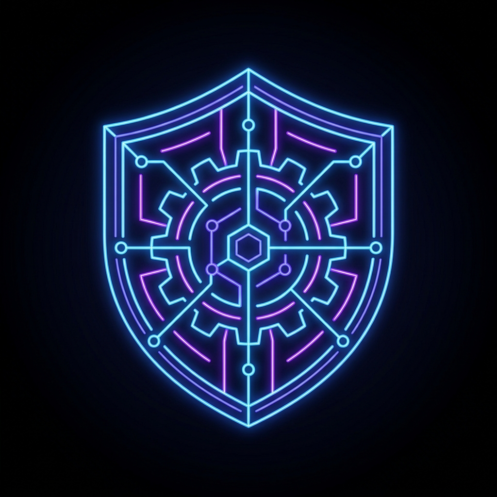
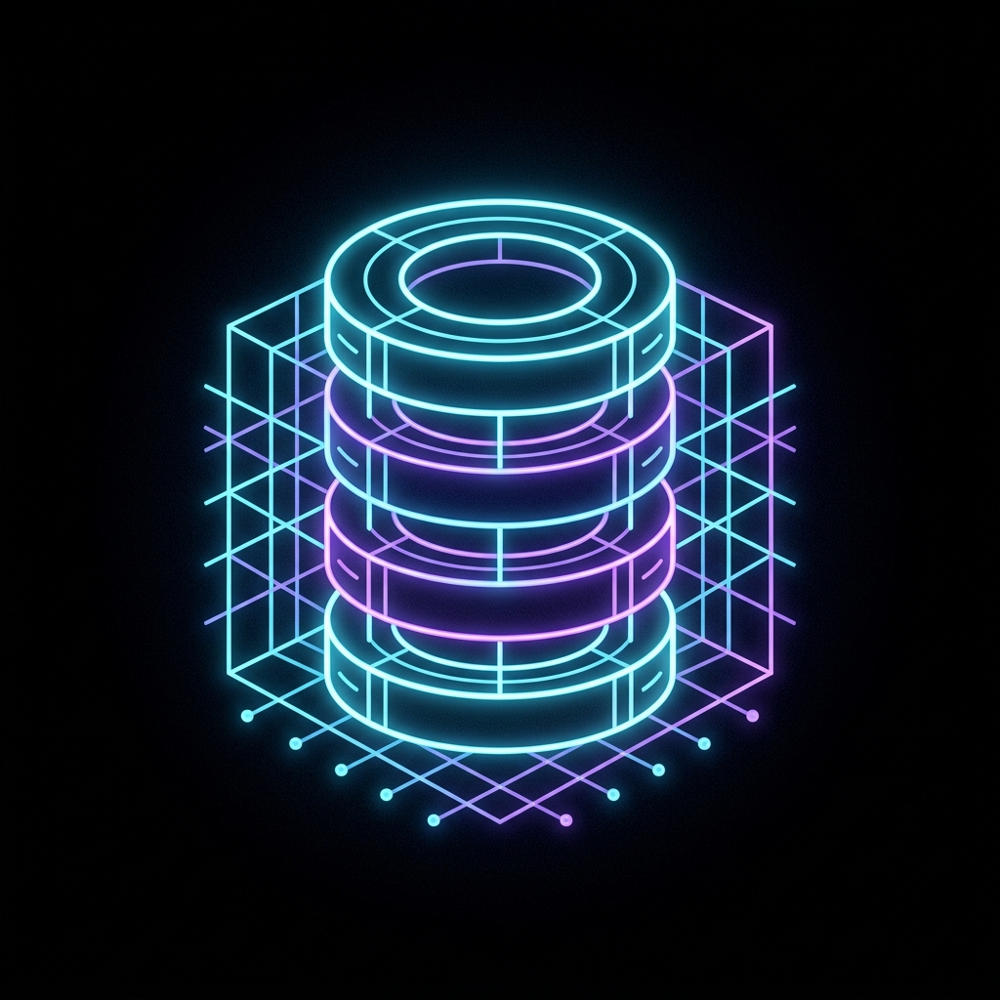
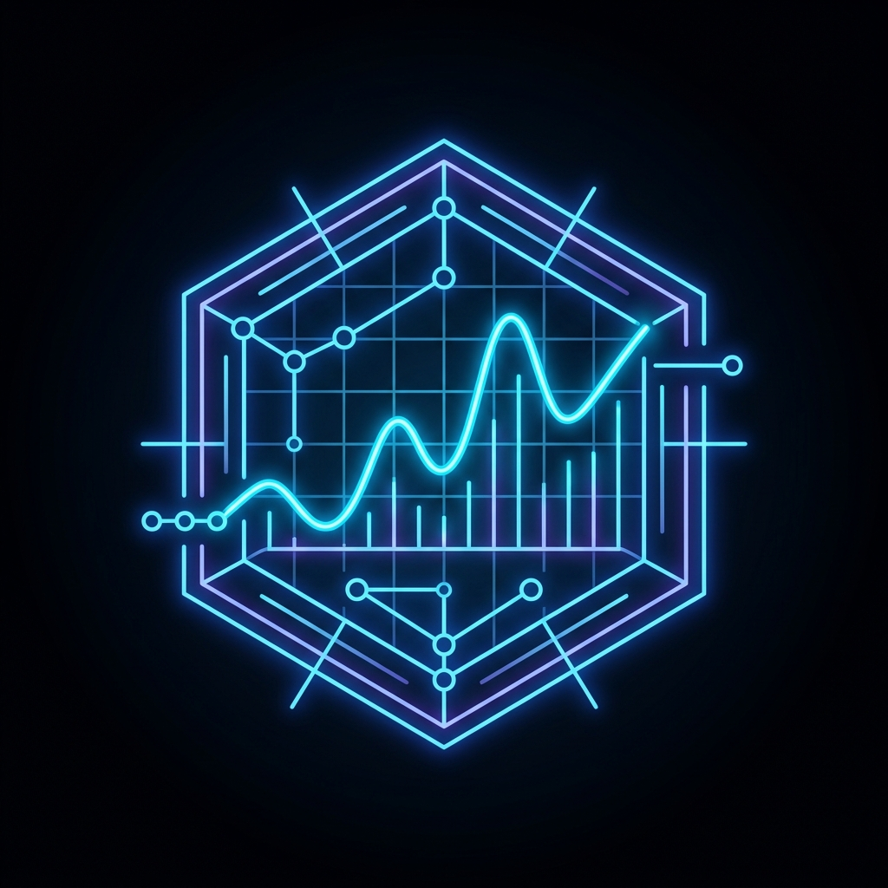

  

  # Andromeda Enterprise AI Platform
  **A production-ready, multi-agent AI operations system architected for 2026.**

  
  
  
  
  

---

> **Note to Reviewers:** Andromeda is not an "LLM wrapper." It is a robust **Agentic Enterprise System** designed to solve the hardest problems in modern AI: non-deterministic hallucinations, state corruption, tool-loop latency, and adversarial prompt injections. It strictly decouples reasoning from business logic using the Model Context Protocol (MCP) and a mathematically rigorous Deterministic Policy Engine.

---

## 🌌 Master System Architecture

The following diagram illustrates the exact, cohesive data flow pipeline from the User interface down to the persistent state Database.

  <table>
    <tr>
      <td align="center" width="20%">
         
        <b>1. User Client</b> 
        Next.js Dashboard
      </td>
      <td align="center" width="5%">➡</td>
      <td align="center" width="20%">
         
        <b>2. API Gateway</b> 
        FastAPI + OTel Tracing
      </td>
      <td align="center" width="5%">➡</td>
      <td align="center" width="40%" colspan="3">
         
        <b>3. LangGraph Orchestrator</b> 
        State Machine Supervisor
      </td>
    </tr>
    <tr>
      <td colspan="4"></td>
      <td align="center">⬇</td>
      <td align="center">⬇</td>
      <td align="center">⬇</td>
    </tr>
    <tr>
      <td colspan="4" align="right"><b>Decoupled MCP Execution ⚡</b></td>
      <td align="center" width="15%">
         
        <b>Policy Agent</b> 
        Zero-Hallucination Guardrails
      </td>
      <td align="center" width="15%">
         
        <b>Retrieval Agent</b> 
        Hybrid RAG (Qdrant + NetworkX)
      </td>
      <td align="center" width="15%">
         
        <b>Support Agent</b> 
        Empathetic Context Formatting
      </td>
    </tr>
    <tr>
      <td colspan="4"></td>
      <td align="center">⬇</td>
      <td align="center">⬇</td>
      <td align="center">⬇</td>
    </tr>
    <tr>
      <td colspan="4"></td>
      <td align="center" colspan="3">
         
        <b>4. Persistent State (AWS RDS PostgreSQL)</b> 
        Immutable Transactions & Locking
      </td>
    </tr>
  </table>

---

## 📐 Mathematical Formulation: Intent & State Execution

Andromeda treats conversation routing as a Markov Decision Process (MDP), mapped inside LangGraph. 
Given a conversation state $S_t = (H, C, E)$, where $H$ is chat history, $C$ is customer profile, and $E$ is extracted entities.

The Supervisor Agent evaluates a routing policy $\pi(S_t)$ to select the optimal subgraph node $N \in \{\text{Policy}, \text{RAG}, \text{Support}\}$.

Once the **Policy Engine** evaluates a transaction, it applies a deterministic step function $f(X)$:

$$ f(X) = \begin{cases} 
1 & \text{if } (X_{\text{age}} \le 30) \land (X_{\text{status}} = \text{"delivered"}) \land (X_{\text{risk}} < \theta) \\
0 & \text{otherwise} 
\end{cases} $$

The result is permanently **locked** in the database via an ACID-compliant transaction. The Generative LLM $G_\phi$ is strictly constrained to formatting the locked output $O$:

$$ P(\text{Response} \mid S_t, f(X)) = G_\phi(S_t \oplus \text{Lock}[f(X)]) $$

This mathematically guarantees **zero hallucination** in financial decisions.

---

## 🛡️ AI Safety & Governance: Failure Modes

The platform implements rigorous security boundaries to prevent Agentic failure modes.

| Threat Vector | Description | Andromeda Mitigation |
| :--- | :--- | :--- |
| **Prompt Injection** | User commands the LLM to ignore instructions and issue a refund. | **Database Locking.** The LLM has zero authority to issue refunds; it can only read the deterministic status locked by Python rules. |
| **Data Exfiltration** | LLM attempts to query arbitrary tables in the SQL database. | **MCP Isolation.** Database access is decoupled via `fastmcp`. The LLM only interacts with Stdio streams and strict Pydantic schemas. |
| **Context Flooding** | User pastes massive text to cause context window collapse. | **Semantic Chunking & Max Tokens.** Input is strictly truncated, and LangGraph memory is windowed before generation. |
| **Hallucinated Policies** | LLM invents a fake return policy to appease an angry user. | **Hybrid RAG.** `sentence-transformers` and Qdrant strictly ground responses in factual policy documents. |

---

## 🔭 2026 Engineering Highlights

### 1. Multi-Agent Orchestration (LangGraph)
Moving beyond fragile `while` loops, Andromeda uses a cyclic **State Machine**. The Supervisor LLM never executes tools directly; it delegates structured tasks to the Retrieval or Policy agents. This guarantees infinite-loop protection and deterministic tool-chain boundaries.

### 2. The Model Context Protocol (MCP)
To achieve Enterprise Zero-Trust, the LLM backend physically cannot access the database credentials. Data is served entirely via local MCP Servers (`Worknoon-CRM`, `Worknoon-Orders`). The LangGraph node requests data via `stdio`, isolating the generative brain from the secure datastore.

### 3. Hybrid RAG (Vector + Graph)
Andromeda utilizes a dual-engine retrieval pipeline:
*   **Vector Search (Qdrant)**: Embeds and retrieves dense policy documents (e.g., "Digital Goods Return Rules").
*   **Knowledge Graph (NetworkX)**: Resolves relational multi-hop queries across Customer → Order → Item schemas which vector stores traditionally fail at.

### 4. Automated Evaluations & CI/CD
Quality is rigorously tested on every `git push`. The `.github/workflows/ci.yml` pipeline triggers **DeepEval** and **RAGAS** scripts to evaluate:
*   **Faithfulness**: Does the output perfectly align with the retrieved context?
*   **Answer Relevancy**: Is the response concise and accurate?
If Faithfulness drops below 95%, the pipeline breaks and deployment is halted.

### 5. Deep Observability (OTel + LangFuse)
*   **LangFuse** tracks exact token costs, latency distributions, and generational logic step-by-step.
*   **OpenTelemetry** traces distributed requests natively from the FastAPI edge through to the SQLAlchemy database execution, aggregating into Prometheus.

---

## 🚀 2026 Enterprise Roadmap

| Phase | Architecture Evolution | Status |
| :---: | :--- | :---: |
| **1** | Core Deterministic Logic & FastAPI Backend | ✅ |
| **2** | LangGraph Multi-Agent State Machine | ✅ |
| **3** | Model Context Protocol (FastMCP) Decoupling | ✅ |
| **4** | Hybrid RAG Integration (Qdrant + NetworkX) | ✅ |
| **5** | LLMOps Observability (LangFuse + OpenTelemetry) | ✅ |
| **6** | Human-in-the-Loop Asynchronous Escalation Queue | ✅ |
| **7** | Production Cloud Infrastructure (AWS + Terraform) | ✅ |

---

  
Engineered for the Future of Agentic Platforms.

