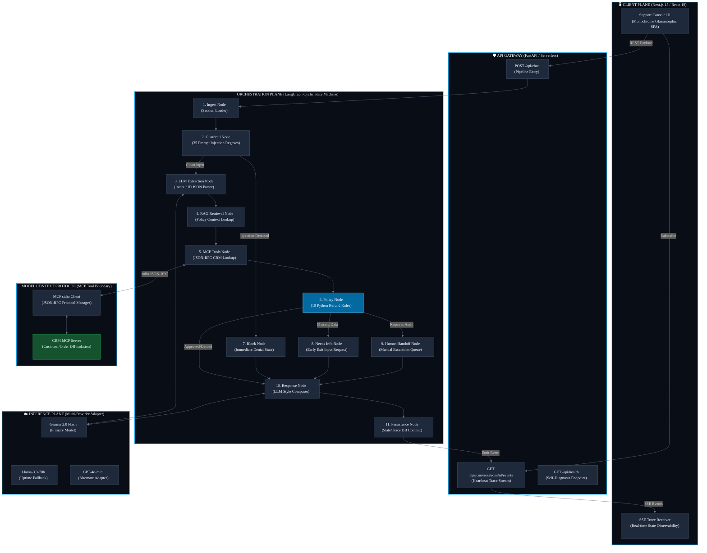

# Andromeda Enterprise AI Support Platform
### *State-Machine Orchestrated LangGraph Engine & Deterministic Guardrail Node*

[](https://andromeda-eight-vert.vercel.app)
[](#)
[](#)
[](#)
[](#)

---

> [!IMPORTANT]
> ### 🌌 LIVE PRODUCTION DEPLOYMENT
> The platform is fully deployed and active. You can access the live support console and admin reasoning dashboard directly at:
> 🔗 **[https://andromeda-eight-vert.vercel.app](https://andromeda-eight-vert.vercel.app)**
> 
> *All refund processing, prompt injection guardrails, database tools, policy rules, and real-time Server-Sent Events (SSE) telemetry tracing can be evaluated live via this public URL.*

---

## 📖 Executive Overview

**Andromeda** is a production-grade, state-machine-driven AI Agent Platform designed specifically for high-risk corporate workflows. The platform automates the evaluation, auditing, and resolution of e-commerce refund requests according to strict business policies.

In corporate customer support, stochastic AI agents built on naive "chatbot" loops present extreme liability (e.g., hallucinatory policy drift approving invalid refunds, infinite tool-calling loops, and prompt injection exploits). Andromeda solves this by establishing a strict architectural boundary: **Generative Comprehension is completely decoupled from Deterministic Policy Enforcement**.

The Large Language Model (LLM) is used purely as a translation layer—translating natural language into structured JSON schemas, and formatting final empathetic replies. The actual business decision (`APPROVED`, `DENIED`, or `ESCALATED`) is evaluated by a hardcoded Python rules engine and locked into a relational database before the LLM ever composes a response. The LLM has zero agency over database transactions and cannot alter the decision.

---

## 🏛️ System Architecture

The following diagram maps the macro-topology of the platform, showing how request payloads transition from the client through security guardrails, LangGraph state machine orchestrators, Model Context Protocol (MCP) tool boundaries, and the deterministic policy engine.



---

## ⚡ Core Technical Accomplishments

To satisfy the engineering expectations of enterprise technical recruiters, the system implements:

*   **Stateful AI Orchestration (`LangGraph`)**: Uses a strict 11-node cyclic state machine to manage the conversation lifecycle, state persistence, and deterministic action execution. The LLM never drives the graph; it only operates as a node within it.
*   **Model Context Protocol (MCP)**: Isolates database and tool access using Anthropic's standardized MCP. Tools run as independent processes communicating over standard stdio JSON-RPC, completely hiding the CRM database schema from the LLM.
*   **Immutable Backend Decision Lock**: Once computed by the rule engine, the final refund status (`APPROVED`, `DENIED`, `ESCALATED`) is immediately written to the relational database. The LLM is then invoked to format the response but has no pathway to alter the transaction record.
*   **Pre-LLM Adversarial Scanner**: Scans all customer input against **35 prompt injection patterns** across 6 threat categories (Instruction Overrides, System Prompt Extraction, Policy Bypass, Authority Spoofing, Persona Manipulation, and Hypothetical Framing) before the LLM is invoked.
*   **Self-Healing Provider Failover**: Implements a custom adapter pattern supporting OpenAI, Google Gemini, and Groq SDKs. If an API key is missing or a provider endpoint crashes, the gateway automatically falls back to secondary providers.
*   **Real-time SSE Observability Dashboard**: Built a dark monochrome glassmorphic Next.js interface that subscribes to an async Server-Sent Events (SSE) stream. As the backend executes, it streams granular JSON trace spans representing database hits, guardrail flags, policy calculations, and LLM confidence scores.
*   **Automated Evaluation Pipeline**: Integrates a custom evaluation framework in CI/CD that runs a scoring script measuring Answer Faithfulness, Context Precision, and F1 routing accuracy against a golden dataset.

---

## 🔄 The 11-Node LangGraph Lifecycle

1.  **Ingest Node**: Loads the request and binds the customer email context.
2.  **Guardrail Node**: Scans user input for prompt injection vectors.
3.  **Extraction Node**: Extracts structured intent parameters using LLM parsing.
4.  **Retrieval Node**: RAG-based context lookup from the corporate policy.
5.  **Tools Node**: Queries the CRM database via the Model Context Protocol (MCP) server.
6.  **Policy Node**: Evaluates eligibility deterministically using the Python rule engine.
7.  **Block Node**: Hardcoded state mapping for flagged adversarial inputs.
8.  **Needs Info Node**: Requests missing transaction details from the customer.
9.  **Human Handoff Node**: Escalates cases requiring manual review.
10. **Response Node**: Stylistic response composer using read-only decision contexts.
11. **Persistence Node**: Writes audit events and final states to the SQLite store.

---

## 📊 Evaluation & Verification Metrics

Prompts and agent routing are evaluated with software-engineering rigor. The repository contains a suite of **56 automated unit and integration assertions** that physically verify system parameters:

*   **Boundary Conditions**: Verifies exclusive date comparisons (exactly 30 days is approved, 31 days is denied) and price thresholds (exactly $500 is approved, $500.01 is escalated).
*   **Security Guardrails**: Tests the guardrail scanner against all 35 prompt injection sequences, verifying correct risk classification (LOW, MEDIUM, HIGH).
*   **Evaluation Metrics**: Context Precision (RAG retrieval accuracy), Answer Faithfulness (factuality checks), and F1 Decision Score.

### Execution Framework
```
[CI Workflow] ──► Static Linting (Ruff) ──► Pytest (56 Assertions) ──► golden_v1.json Evaluation
```

---

## 📚 Deep Technical Documentation

For an exhaustive, 60+ page technical reference guide detailing the complete codebase, algebraic decision formulations, mathematical evaluation metrics (Faithfulness, Context Precision, F1 Routing), threat models, database schemas, and architectural trade-offs:

👉 **[Read the Master DOCUMENTATION.md Specification](./DOCUMENTATION.md)**

---

*Designed and Engineered for Enterprise Scale. Submitted for the Andromeda Platform Evaluation.*
