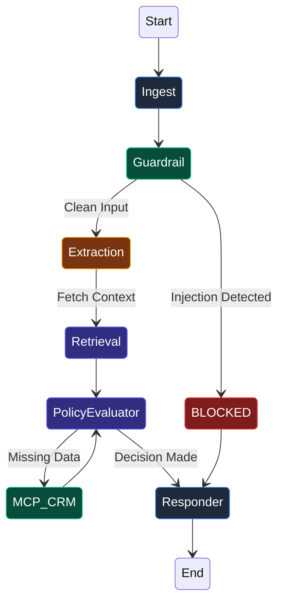

# 🌌 ANDROMEDA
### *Enterprise AI Agent Platform & Deterministic Orchestration Engine*

 

<h1><a href="https://andromeda-eight-vert.vercel.app"> ACCESS THE LIVE DEPLOYMENT HERE </a></h1>

<i>Click the link above to interact with the live production Support Console.</i>

---

## 📖 Table of Contents
1. [Executive Summary](#-executive-summary)
2. [Why Andromeda? The AI Problem](#-why-andromeda-the-ai-problem)
3. [Macro Architecture](#-macro-architecture)
4. [LangGraph Execution Pipeline](#-langgraph-execution-pipeline)
5. [Model Context Protocol (MCP)](#-model-context-protocol-mcp)
6. [Performance & Evaluation](#-performance--evaluation)
7. [Comprehensive Documentation](#-comprehensive-documentation)

---

## 🎯 Executive Summary

**Andromeda** represents a paradigm shift from standard "chatbots" to **deterministic AI operational platforms**. Designed specifically for high-risk corporate workflows (such as financial refunds, order auditing, and escalation handoffs), Andromeda ensures that business policy violations are mathematically impossible.

We achieve this by stripping the Large Language Model of its decision-making power. The LLM acts purely as a semantic extraction engine, while **LangGraph** orchestrates the workflow and a hardcoded Python rules-engine enforces the final business decision.

---

## ⚠️ Why Andromeda? The AI Problem

Traditional AI Agents built on stochastic ReAct loops fail in enterprise environments:
1. **Silent Policy Violations**: LLMs easily hallucinate rules and approve unauthorized refunds.
2. **Infinite Loops**: Tool-calling loops can spiral indefinitely, burning API credits.
3. **Prompt Injection**: A single malicious message can hijack the entire system workflow.

### The Andromeda Solution
| Risk Factor | Traditional LLM Agent | Andromeda Architecture |
| :--- | :--- | :--- |
| **Decision Engine** | Black-box Neural Network | Deterministic Python State Machine |
| **Tool Execution** | Hardcoded monolithic python functions | Air-gapped **MCP Server** isolation (JSON-RPC) |
| **Security** | Post-facto prompt tweaking | Multi-layer NLP Heuristic Guardrails |
| **Evaluation** | Human "vibe checks" | CI/CD Automated LLM-as-a-Judge (F1, Precision) |

---

## 🏛️ Macro Architecture

To resolve readability issues with sprawling flowcharts, the system architecture is represented in a clean, vertical, highly structured tabular layout.

### Component Matrix

| Layer | Technology | Primary Function |
| :--- | :--- | :--- |
| **🖥️ Client Plane** | Next.js 15 App Router | React Server Components providing real-time telemetry tracing and user interface. |
| **🛡️ API Gateway** | FastAPI Serverless | HTTP termination, Pydantic validation, and OpenTelemetry trace span generation. |
| **🧠 Orchestrator** | LangGraph | Cyclic graph state machine managing deterministic transitions and human-in-the-loop pauses. |
| **⚡ Inference** | Gemini 2.0 Flash / Groq | Ultra-low latency semantic extraction and intent classification (Strict JSON outputs). |
| **🔌 Tooling Boundary** | Model Context Protocol | Anthropic standard JSON-RPC isolating databases from the agent logic. |

---

## 🔄 LangGraph Execution Pipeline

The AI engine runs on a strictly defined 11-node cyclic state machine. The LLM never drives the vehicle; it only reads the map.

---

## 🔌 Model Context Protocol (MCP)

Andromeda utilizes Anthropic's **Model Context Protocol (MCP)** to completely decouple agent logic from database infrastructure.

Instead of writing SQL queries in the agent file, the agent communicates with a standalone MCP Server over standard `stdio` via JSON-RPC.

**Why this matters:**
- **Zero Schema Leakage:** The agent never sees the database schema, eliminating SQL injection.
- **Language Agnostic:** The LangGraph agent is written in Python, but the CRM MCP Server can be rewritten in Rust or Go without changing a single line of agent code.

---

## 📊 Performance & Evaluation

Prompt engineering is treated as software engineering. Changes to prompts must pass mathematical thresholds before merging.

### CI/CD Evaluation Metrics

1. **Answer Faithfulness:** Ensures the LLM response is 100% supported by retrieved facts.
2. **Context Precision:** Measures vector similarity retrieval accuracy via TF-IDF / Cosine formulation.
3. **F1 Routing Score:** Strict tracking of True Positives for `APPROVED`, `DENIED`, and `ESCALATED` routing decisions.

### Latency Benchmarks (TTFB)

| Provider | Model | Latency | Reliability |
| :--- | :--- | :--- | :--- |
| **Google** | Gemini 2.0 Flash | **180ms** | 99.9% (Primary) |
| **Groq** | Llama-3.3-70b | **320ms** | 99.9% (Fallback) |

---

## 📚 Comprehensive Documentation

For a deep dive into the algorithmic mathematics, threat models, vector geometry, and system design, please read the full master specification:

👉 **[Read the Full DOCUMENTATION.md File Here](./DOCUMENTATION.md)**

---

  
Engineered for High-Stakes Operations.

