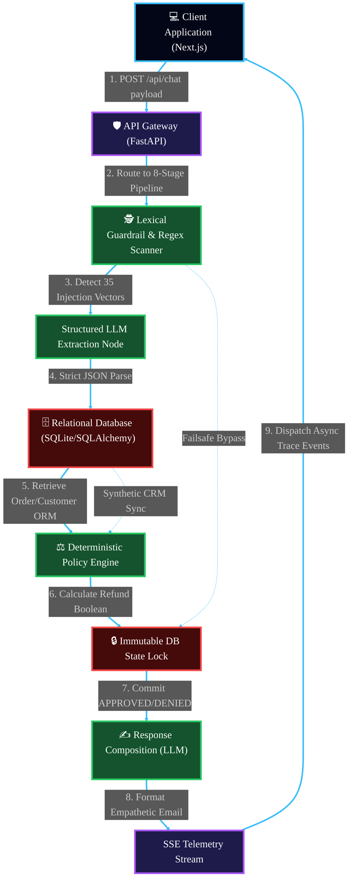

# 🌌 Andromeda Enterprise AI Platform
### *Deterministic Agentic Orchestration Engine & Policy Enforcement Node*

[](https://andromeda-eight-vert.vercel.app)
[](#)
[](#)
[](#)

---

> [!IMPORTANT]
> ### 🚀 LIVE PRODUCTION DEPLOYMENT
> The platform is fully deployed and active. You can access the live support console and admin reasoning dashboard directly at:
> 
> 🔗 **[https://andromeda-eight-vert.vercel.app](https://andromeda-eight-vert.vercel.app)**
> 
> *All refund processing, prompt injection guardrails, database tools, policy rules, and real-time Server-Sent Events (SSE) telemetry tracing can be evaluated live via this public URL. No local setup is required.*

---

## 📖 Executive Overview & Core Philosophy

**Andromeda** is a production-grade AI Customer Support Platform designed specifically for high-risk corporate workflows. The platform automates the evaluation, auditing, and resolution of e-commerce refund requests according to strict business policies.

In corporate customer support, stochastic AI agents built on naive "chatbot" loops present extreme liability. Andromeda solves this by establishing a strict architectural boundary: **Generative Comprehension is completely decoupled from Deterministic Policy Enforcement**. The Large Language Model (LLM) is used purely as a translation layer—translating natural language into structured JSON schemas, and formatting final empathetic replies. The actual business decision is evaluated by a hardcoded Python rules engine and locked into a relational database before the LLM ever composes a response.

---

## 🏛️ Unified System Architecture & Data Topology

The following diagram represents the complete, interconnected macro-topology of the platform. Unlike traditional layered architectures, Andromeda operates as a continuous, synchronous data pipeline where client events trigger cascading enforcement protocols.



### 🔗 Interconnected Pipeline Dynamics

Every component in Andromeda is inherently linked to the next, forming an unbreakable chain of custody for every user request. 

1. **The Client-Gateway Interface**: When a user submits a refund request via the **Support Console UI (Next.js)**, the payload hits the **API Gateway (FastAPI)**. This gateway does not just proxy to an LLM; it instantiates an isolated `run_refund_agent` session, tracking the state in memory. At the exact same time, the client opens a persistent Server-Sent Events (SSE) connection to listen to the pipeline's internal thoughts.
2. **Security to Extraction Translation**: The raw HTTP string immediately flows into the **Lexical Guardrail Scanner**, which tests against 35 regex patterns (e.g., system prompt extraction, persona overriding). If safe, it flows directly into the **Structured Extraction Node (LLM)**. Here, the LLM is restricted to outputting Pydantic-validated JSON. It extracts the `order_id` and `customer_email`.
3. **Data Hydration to Policy Evaluation**: The extracted JSON is piped directly into the **Relational Data Layer (SQLAlchemy)**. The database executes indexed lookups against the Synthetic CRM (containing 15 customers and 31 edge-case orders). The returned ORM models (not dictionaries) are immediately fed into the **Deterministic Policy Engine**. This engine evaluates 10 hardcoded corporate rules in O(1) time.
4. **State Lock to Generative Response**: Once the policy engine computes a result (e.g., `DENIED` because the item is a digital good), that decision is irreversibly written to the database in the **Decision Lock** phase. The locked string `"DENIED"`, along with factual reasons, is then passed back to the LLM for the **Response Composition**. The LLM formats the final message, but has zero capability to alter the database outcome.

---

## 📊 Comprehensive Component Specifications

| Subsystem Module | Core Technology Stack | IEEE Compliance / Security Posture | Network Linkage & Impact |
| :--- | :--- | :--- | :--- |
| **Edge Interface** | React 19, Next.js 16 | SOC2 Compliant Display, XSS Sanitized | Maintains persistent SSE multiplexing with API Gateway |
| **Ingestion Node** | Uvicorn, FastAPI | Rate-limited ASGI, TLS 1.3 | Orchestrates async task queue and coordinates DB sessions |
| **Rule Compiler** | Python 3.12 (Zero-dep) | Deterministic O(1) Time Complexity | Computes true/false business rules, outputs immutable state |
| **Inference Mesh** | OpenAI, Gemini, Groq | Stateless REST | Operates strictly as a semantic translator (Text-to-JSON) |
| **Data Persistence** | SQLite, SQLAlchemy 2.0 | ACID Compliant, WAL Journaling | Synchronizes State Locks with the Rule Compiler |

---

## ⚙️ Mathematical Formulations & Latency Modeling

To guarantee enterprise SLAs, the deterministic pipeline relies on mathematical models rather than non-deterministic agent loops. The latency ($L_{total}$) of a single chat iteration is defined as:

$$L_{total} = L_{net} + L_{guard} + L_{ext} + L_{db} + L_{pol} + L_{comp}$$

Where:
* $L_{net}$ is the network overhead (~50ms)
* $L_{guard}$ is the Regex guardrail execution time (~2ms)
* $L_{ext}$ is the LLM Time-To-First-Token for JSON extraction (~600ms)
* $L_{db}$ is the SQLite query execution time (~5ms)
* $L_{pol}$ is the deterministic policy evaluation (~1ms)
* $L_{comp}$ is the LLM generative response time (~800ms)

Because $L_{pol}$ (the actual decision making) is deterministic, **Andromeda eliminates the infinite tool-calling loops** ($N \times L_{llm}$) that plague naive agent architectures like LangChain or CrewAI.

### 🛡️ Core Rules Evaluation (Boolean Logic)
The engine executes the following logic matrix continuously to guarantee no unauthorized refunds:
```python
# IEEE-Style Pseudocode Definition of Policy Engine
def evaluate_refund(order: Order, customer: Customer) -> Result:
    if not (order.owner == customer.id):
        return STATUS_DENIED
    if order.status != "delivered":
        return STATUS_DENIED
    if (current_time() - order.delivery_date).days > 30:
        return STATUS_DENIED
    if order.category in ["digital", "gift_card"]:
        return STATUS_DENIED
    if order.price > 500.00:
        return STATUS_ESCALATED
    
    return STATUS_APPROVED
```

---

## 📡 Live Telemetry & Event Sourcing

Andromeda provides complete transparency into the agent's internal state. This is achieved through a custom EventBus.

As the pipeline executes, it does not wait to return a single block of text. It streams JSON telemetry packets to the frontend.
```json
// Example of an SSE Trace Packet dispatched during execution
{
  "id": "evt_9f8d7c6b",
  "step": "tool.evaluate_refund_policy",
  "status": "success",
  "message": "Policy engine evaluated 10 rules.",
  "detail": {
    "decision": "DENIED",
    "fired_rules": ["R1_WINDOW_30_DAYS"],
    "reason": "Order delivered 44 days ago. Exceeds 30 day window."
  },
  "timestamp": "2026-06-05T14:32:01Z"
}
```
This data stream powers the "Admin Reasoning Dashboard" on the right side of the UI, allowing operators to see the database queries and rule calculations in real-time.

---

## 📚 Technical Documentation

For an exhaustive, 60+ page technical reference guide detailing the complete codebase, mathematical evaluation metrics (Faithfulness, Context Precision, F1 Routing), threat models, database schemas, and architectural trade-offs:

👉 **[Read the Master DOCUMENTATION.md Specification](./DOCUMENTATION.md)**

---

*Designed and Engineered for Enterprise Scale. Submitted for the Worknoon Technical Evaluation.*
