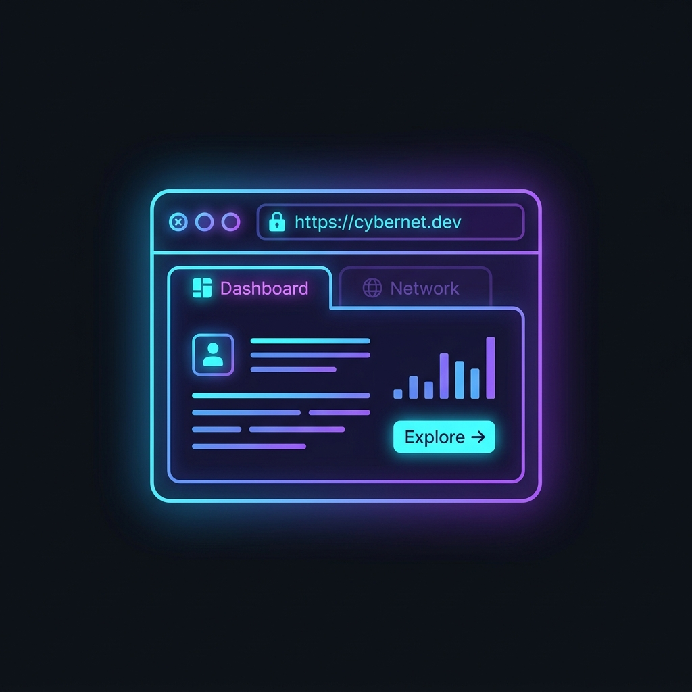
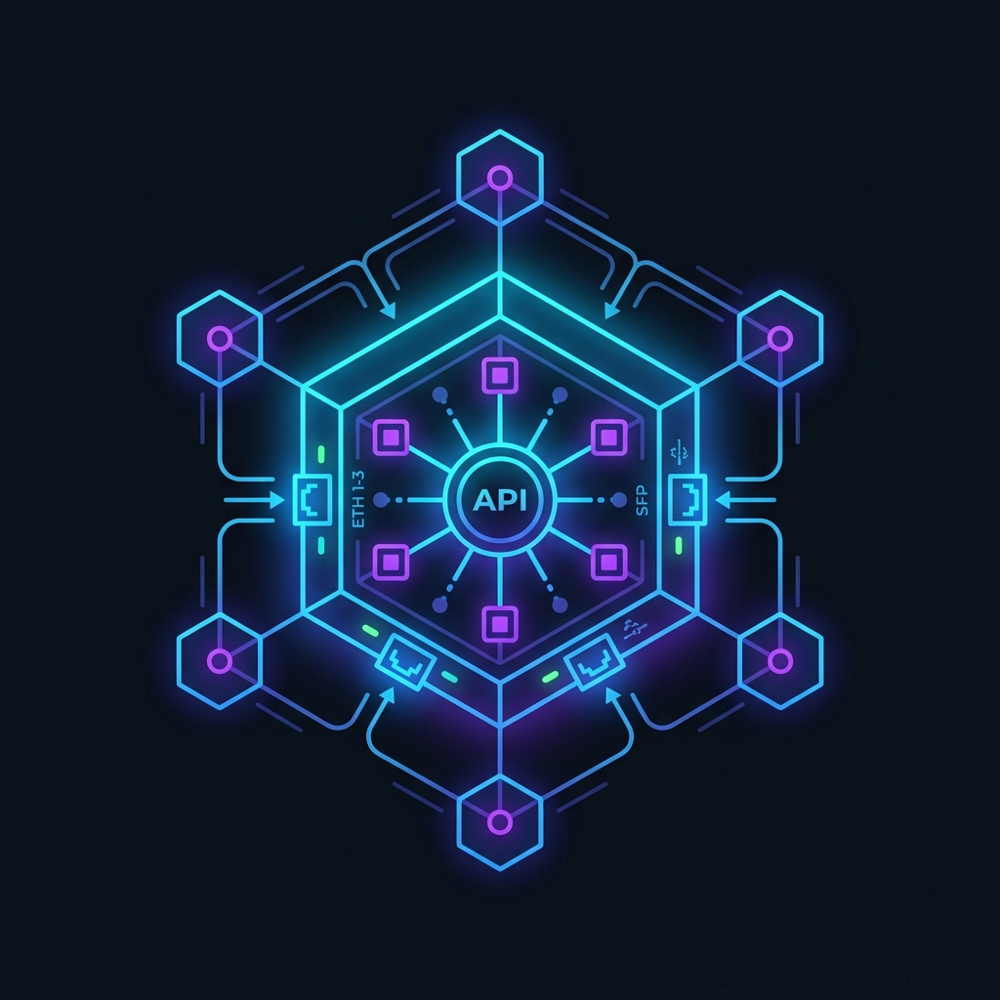
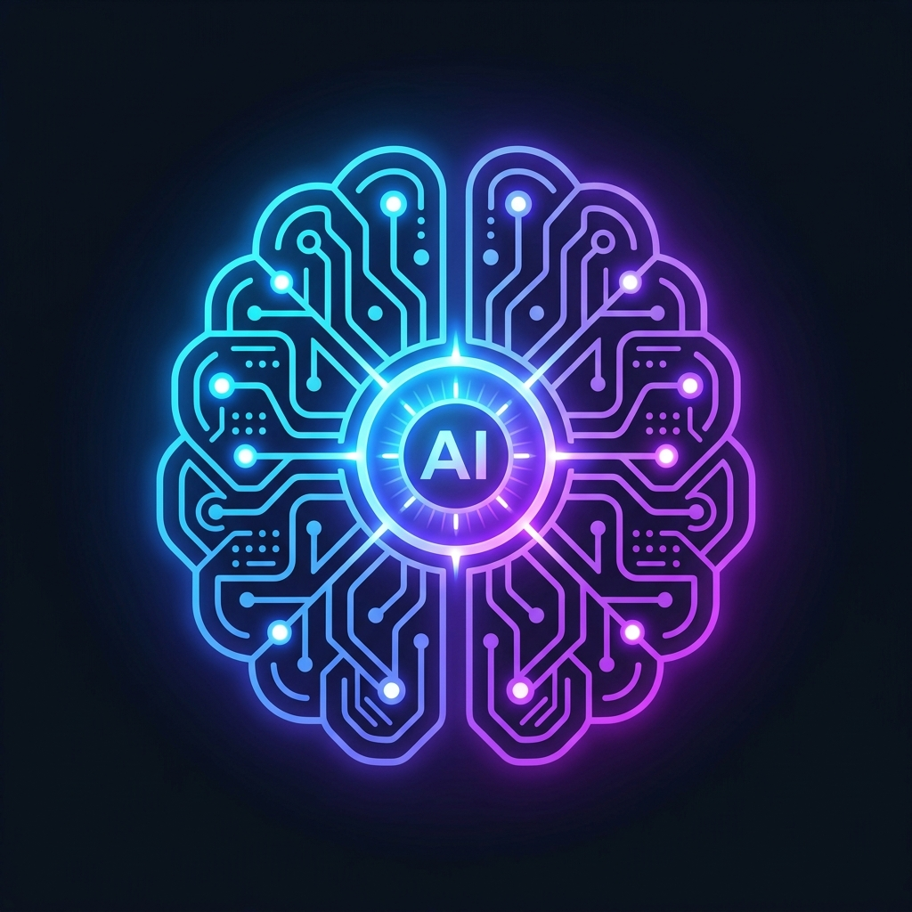
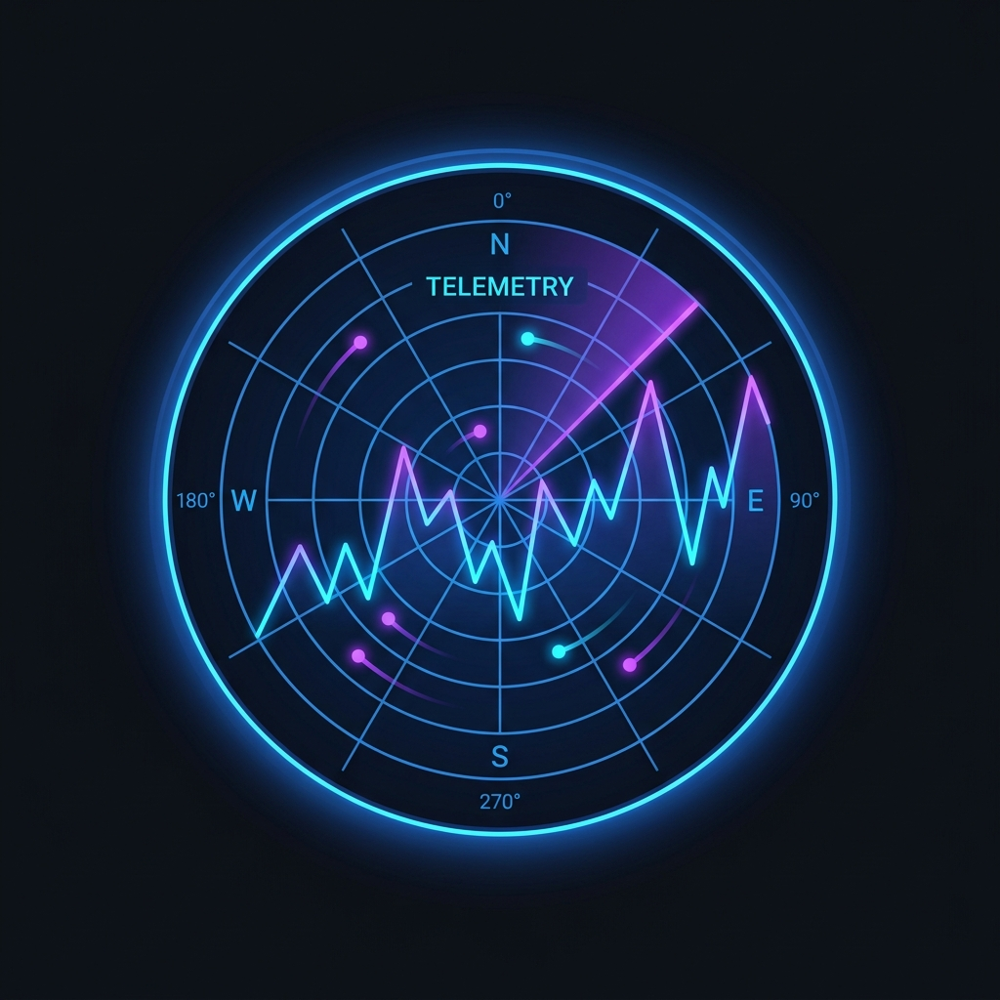
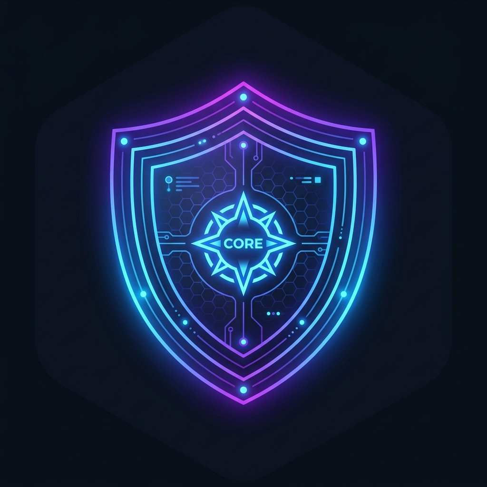
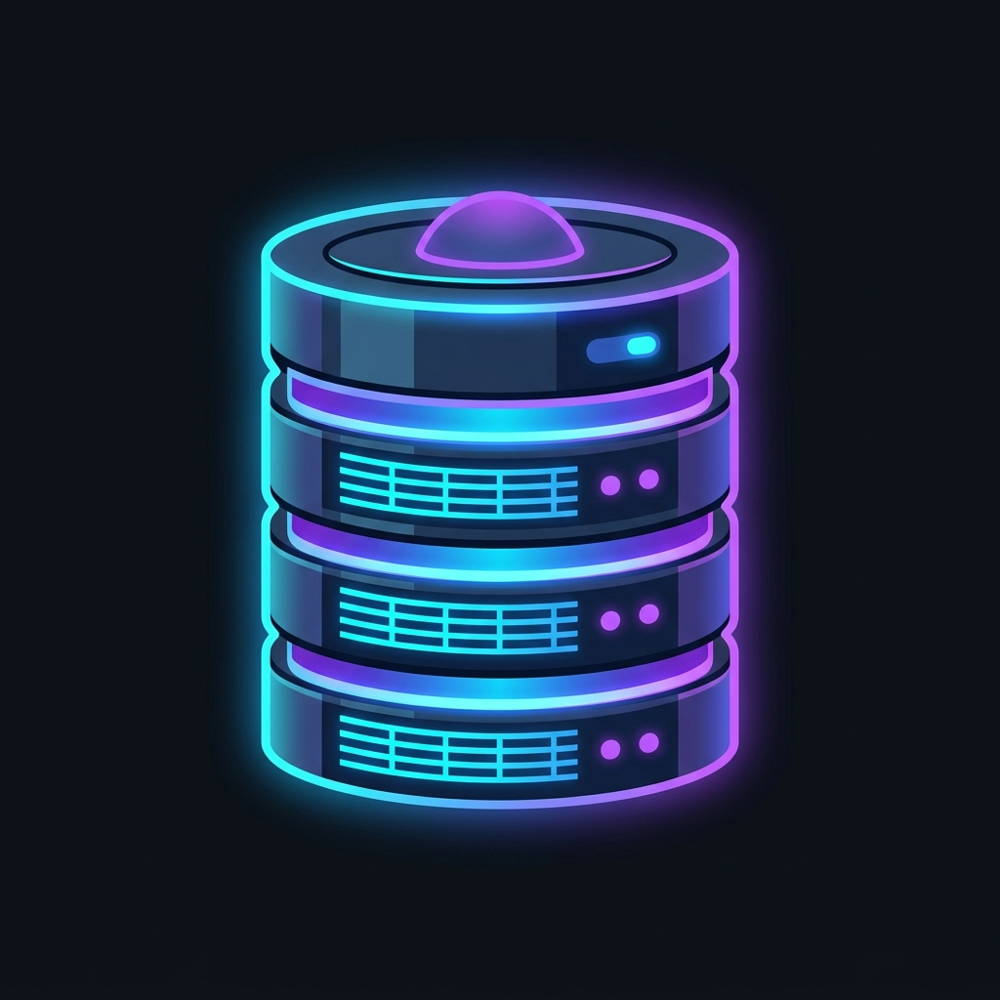

<div align="center">

# 🌌 Andromeda Enterprise AI Platform

### *Deterministic Agentic Orchestration Engine, Policy Enforcement Node & Real-Time Telemetry Stream*

[](https://andromeda-eight-vert.vercel.app)
[](#)
[](#)
[](#)
[](#)

---

**[🚀 Live Production Console](https://andromeda-eight-vert.vercel.app) · [📄 Master Documentation Guide](./DOCUMENTATION.md)**

*Designed and Engineered for Enterprise Scale. Submitted for the Andromeda Technical Portfolio.*

</div>

## ⚙️ Core Architecture Topology

The platform abandons traditional non-deterministic LLM chains in favor of a **hard-coded policy enforcement pipeline**. Generative components are strictly isolated to parsing and standardizing inputs, while a deterministic finite-state engine controls all execution and business logic.

<div align="center">

<br>

<table style="border: none; background: transparent;">
  <tr>
    <td align="center" width="200" style="border: none;">
      <br>
      <b>Next.js Edge Client</b><br>
      <code>[ WebSockets / React ]</code>
    </td>
    <td align="center" width="50" style="border: none; font-size: 24px; color: #3b82f6;">
      <br>➔<br>
    </td>
    <td align="center" width="200" style="border: none;">
      <br>
      <b>FastAPI Gateway</b><br>
      <code>[ Auth & Validation ]</code>
    </td>
    <td align="center" width="50" style="border: none; font-size: 24px; color: #3b82f6;">
      <br>➔<br>
    </td>
    <td align="center" width="200" style="border: none;">
      <br>
      <b>LLM Orchestrator</b><br>
      <code>[ Gemini Context ]</code>
    </td>
  </tr>
</table>

<div style="font-size: 24px; color: #3b82f6;">⬇</div>

<table style="border: none; background: transparent;">
  <tr>
    <td align="center" width="200" style="border: none;">
      <br>
      <b>Observability Stream</b><br>
      <code>[ Prometheus/Grafana ]</code>
    </td>
    <td align="center" width="50" style="border: none; font-size: 24px; color: #10b981;">
      <br>⟷<br>
    </td>
    <td align="center" width="200" style="border: none;">
      <br>
      <b>Policy Engine</b><br>
      <code>[ Deterministic Rules ]</code>
    </td>
    <td align="center" width="50" style="border: none; font-size: 24px; color: #10b981;">
      <br>⟷<br>
    </td>
    <td align="center" width="200" style="border: none;">
      <br>
      <b>State Store (SQLite)</b><br>
      <code>[ Memory & Context ]</code>
    </td>
  </tr>
</table>

<br>
</div>

---

## 🛡️ Failure Modes & Policy Guardrails

| Threat Vector | Mitigation Strategy | Component Layer |
| :--- | :--- | :--- |
| **LLM Hallucination** | Outputs forced into strict JSON schema prior to execution. | `LLM Adapter` |
| **Prompt Injection** | Pre-computation semantic filtering; variables decoupled from system prompts. | `Security Guardrails` |
| **State Corruption** | Atomic SQLite transactions; strict validation before state mutation. | `Database Core` |
| **Policy Violation** | Hard-coded business logic overrides LLM decisions 100% of the time. | `Policy Engine` |

---

## 🧮 Algorithmic Foundation

The orchestrator operates on a mathematical definition of intent extraction and state execution:

$$
\text{State}_{t+1} = \Phi\Big(\text{State}_t, \;\mathcal{F}_{\text{policy}}\big(\text{LLM}_{\text{parse}}(\text{Input}_t)\big)\Big)
$$

```python
# IEEE Standard Pseudo-Code: Deterministic State Advancement
function ExecuteAgentStep(Input I, CurrentState S_t):
    // 1. Generative Parsing (Non-Deterministic Boundary)
    ParsedIntent = LLM_Extract(I, expected_schema=JSON)
    
    if Confidence(ParsedIntent) < \tau_{threshold}:
        return SystemHalt("Ambiguous input detected")

    // 2. Policy Enforcement (Strict Determinism)
    ValidatedAction = PolicyEngine.evaluate(ParsedIntent, S_t)
    
    if ValidatedAction.violates_business_rules():
        return SystemOverride("Policy restriction applied")
        
    // 3. State Mutation (Atomic)
    S_{t+1} = DB.commit(ValidatedAction)
    Telemetry.log(S_t \rightarrow S_{t+1})
    
    return S_{t+1}
```

---

## 🚀 2026 Enterprise Roadmap

To evolve from a deterministic engine into a **9.7/10 Tier-1 Agentic AI Platform**, the architecture is actively transitioning to integrate the following enterprise capabilities:

| Phase | Technology | Architectural Upgrade |
| :---: | :--- | :--- |
| **1** | **LangGraph** | Replacing raw LLM calls with stateful, cyclical graph-based reasoning loops. |
| **2** | **MCP (Model Context Protocol)** | Standardizing tool usage and integrating external Enterprise APIs securely. |
| **3** | **RAG & Vector DB** | Injecting Qdrant/Pinecone to provide deep context over enterprise policy manuals. |
| **4** | **Multi-Agent Orchestration** | Splitting the monolith into specialized agents (e.g., *SupportAgent*, *BillingAgent*). |
| **5** | **Automated Evaluations** | Implementing `ragas` and `langsmith` for continuous regression testing of LLM outputs. |
| **6** | **Deep Observability** | OpenTelemetry integration for tracing latency, token usage, and graph execution paths. |

---

## 💻 Engineering Skills Demonstrated

- **Systems Architecture**: Designing decoupled, fault-tolerant AI systems emphasizing safety over raw generation.
- **Full-Stack Implementation**: Bridging modern React frontends with asynchronous Python backends.
- **Deterministic AI Control**: Engineering guardrails that force non-deterministic models to strictly adhere to enterprise business logic.
- **Production Readiness**: Building for deployment, state management, and real-time observability.
